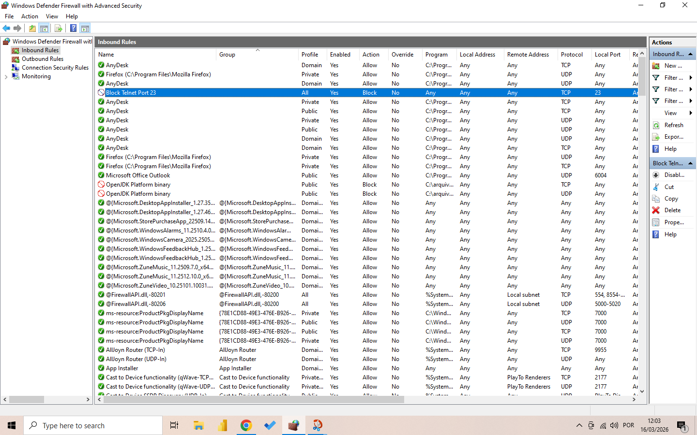
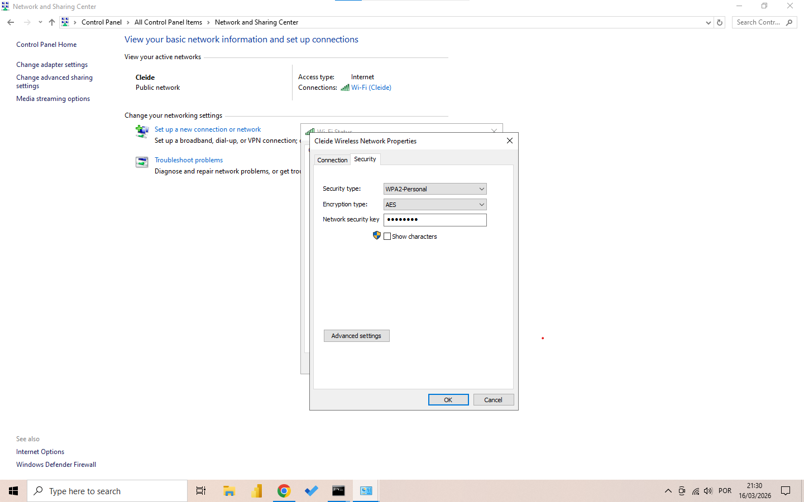
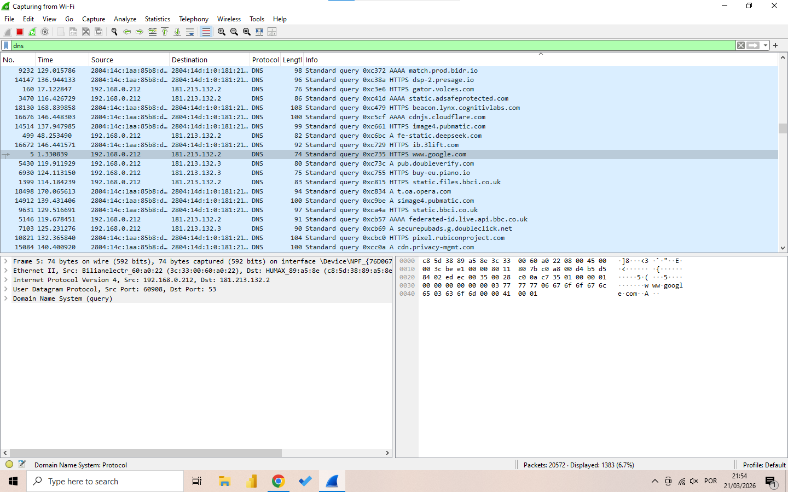
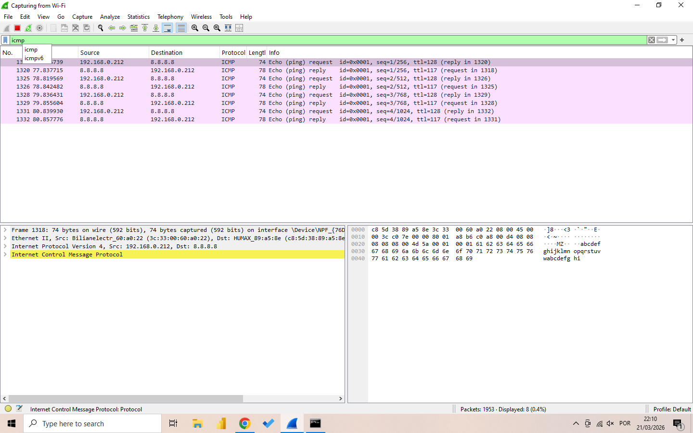
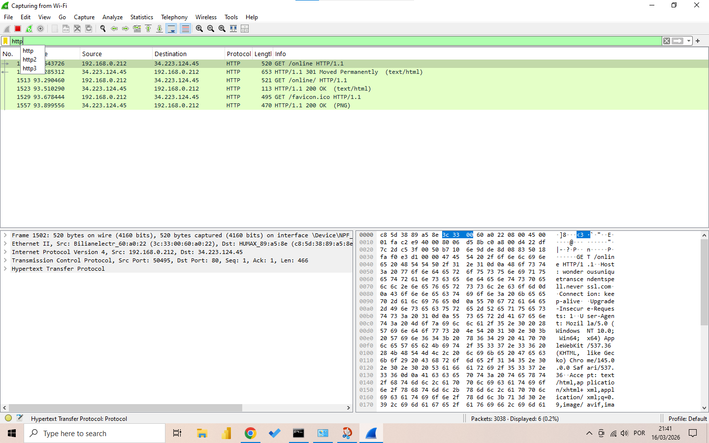
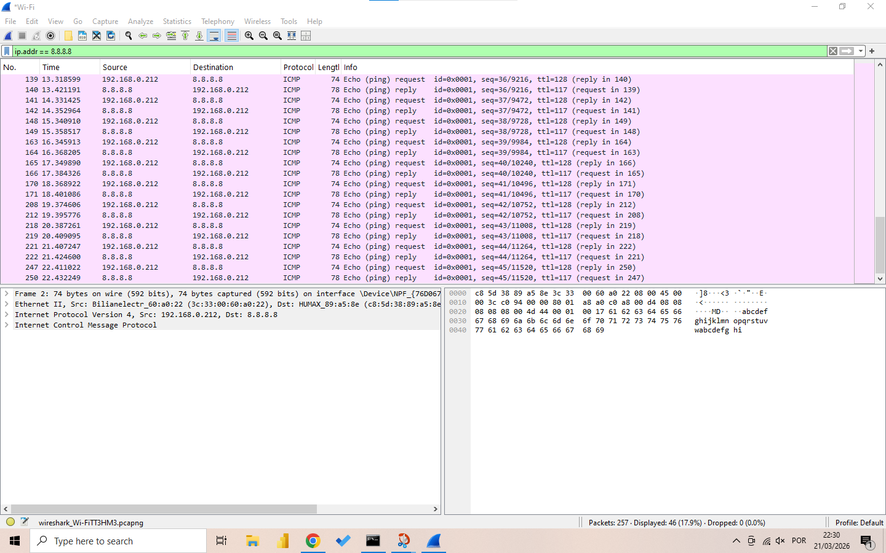

# Task 1: Network Security Basics

## 📌 Objective
Understand the basics of network security by learning about different types of network threats and how to implement basic security measures.

---

## 1. Network Security Concepts

### Network Threats Research

| Threat | Description | Real-World Example |
|--------|-------------|-------------------|
| **Virus** | Malware that attaches itself to legitimate programs and spreads when the infected program is executed | **ILOVEYOU virus (2000)**: Disguised as a love letter text file, it overwrote files and spread by sending itself to all contacts in the victim's Microsoft Outlook address book, causing an estimated $10 billion in damages worldwide |
| **Worm** | Self-replicating malware that spreads automatically across networks without user interaction | **Blaster Worm (2003)**: Exploited a vulnerability in Windows RPC to spread automatically across the internet, causing computers to repeatedly crash and reboot. It also attempted to launch a DDoS attack against Microsoft's Windows Update website |
| **Trojan** | Malicious software disguised as legitimate software | **Bumblebee Trojan (2025)**: Distributed through phishing emails with fake voicemail notifications containing malicious Word documents. When opened, it launches PowerShell commands that download additional payloads like Cobalt Strike for network access and ransomware attacks |
| **Phishing** | Social engineering attack that tricks users into revealing sensitive information | **Fake Invoice Campaign (2025)**: Attackers sent emails with fake invoices containing malicious Visual Basic Script (.vbs) files disguised as "INV-20192,INV-20197.vbs". When opened, it installed XWorm RAT that could steal passwords, record keystrokes, and install ransomware—all without the user knowing |

### Basic Security Concepts

| Concept | Description |
|---------|-------------|
| **Firewall** | Acts as a barrier between trusted and untrusted networks, controlling traffic based on rules |
| **Encryption** | Converts data into a coded format to prevent unauthorized access (WPA2/WPA3 for Wi-Fi) |
| **Secure Configurations** | Changing default settings, disabling unnecessary services, and applying security best practices |

---

## 2. Basic Security Measures Implemented

### Network Environment
- **Environment used:** Home network
- **Router:** [Your router model]
- **Devices:** Windows 11 laptop and smartphone

### Firewall Configuration (Windows Defender Firewall)

**Steps taken:**
1. Opened Windows Defender Firewall with Advanced Security (`wf.msc`)
2. Verified firewall is active for all profiles (Domain, Private, Public)
3. Created inbound rule to block port 23 (Telnet) as a preventive measure

**Why?** Telnet sends data in plain text and represents a security risk. Blocking unnecessary ports reduces the attack surface.

<!---->

### Wi-Fi Security Configuration

**Steps taken on router:**
1. Changed default administrator password
2. Enabled WPA3 encryption (or WPA2 if WPA3 not available)
3. Disabled WPS (Wi-Fi Protected Setup)

**Why?** 
- Default passwords are easily found online
- WPA3 provides stronger encryption than WPA2, protecting data from sniffing attacks
- WPS has known vulnerabilities

<!---->

---

## 3. Network Traffic Analysis with Wireshark

### Traffic Captured

#### HTTP Traffic
Filter: `http`
<!---->

HTTP traffic is unencrypted, meaning anyone on the network can see the data being transmitted.

#### DNS Traffic
Filter: `dns`
<!---->

DNS queries reveal which websites are being accessed, as domain names are visible.

#### ICMP Traffic (Ping)
Filter: `icmp`
<!---->

ICMP is used for network diagnostics (ping commands).

#### Encrypted Traffic (HTTPS/TLS)
Filter: `tls` or `https`
<!---->

Note that while you can see a connection is made, the content is encrypted and unreadable.

### Identifying Suspicious Traffic

**Potential indicators of compromise:**
- **Unusual outbound connections** to unknown IP addresses
- **High volume of traffic** from a single device (possible data exfiltration)
- **Repeated connection attempts** to multiple ports (port scanning)
- **DNS queries to known malicious domains**

Example of suspicious activity:
<!---->

---

## 4. Discussion: How Security Measures Protect the Network

| Measure | Protection Provided |
|---------|---------------------|
| **Firewall** | Blocks unauthorized inbound connections and can prevent malware from calling home |
| **WPA3 Encryption** | Ensures wireless data is confidential and cannot be intercepted by nearby attackers |
| **Strong Passwords** | Prevents unauthorized access to router configuration and Wi-Fi network |
| **Traffic Monitoring** | Allows early detection of anomalous behavior that might indicate a breach |

These basic measures work together to create multiple layers of defense (defense in depth). Even if one measure fails, others still provide protection.

---

## 5. Reflection on Security Best Practices

### Additional Measures for Larger Networks

In a larger, more complex network, I would implement:

| Measure | Purpose |
|---------|---------|
| **Network Segmentation (VLANs)** | Isolate sensitive departments (Finance, HR) from general traffic |
| **Intrusion Detection System (IDS)** | Automatically detect and alert on suspicious patterns |
| **Centralized Logging (SIEM)** | Correlate events across multiple devices to identify complex attacks |
| **Multi-Factor Authentication (MFA)** | Add an extra layer of security for critical systems |
| **Regular Vulnerability Scanning** | Proactively identify and patch weaknesses |

### Educating Others About Network Security

*"I would educate others by using simple analogies: compare the firewall to a security guard who checks IDs before letting people in, encryption to a sealed envelope that prevents anyone from reading your letter during delivery, and strong passwords to a good lock on your front door. I would emphasize that security is everyone's responsibility, not just IT's, and encourage them to be cautious with emails (phishing), use password managers, and always keep devices updated. Most importantly, I would create a culture where asking questions and reporting suspicious activity is encouraged, not punished."*

---

## 📸 Screenshots

--All screenshots are stored in the [`/screenshots`](./screenshots) folder.

| Screenshot | Description |
|------------|-------------|
| `firewall-config.png` | Windows Defender Firewall rules |
| `wifi-security.png` | Router WPA3 configuration |
| `wireshark-http.png` | HTTP traffic capture |
| `wireshark-dns.png` | DNS queries |
| `wireshark-icmp.png` | ICMP ping traffic |
| `wireshark-https.png` | Encrypted TLS traffic |
| `wireshark-suspicious.png` | Example of suspicious activity |-->

---

## ✅ Task Completion Status

- [x] Network threats researched
- [] Firewall configured
- [] Wi-Fi security configured
- [] Wireshark traffic captured and analyzed
- [] Documentation complete
