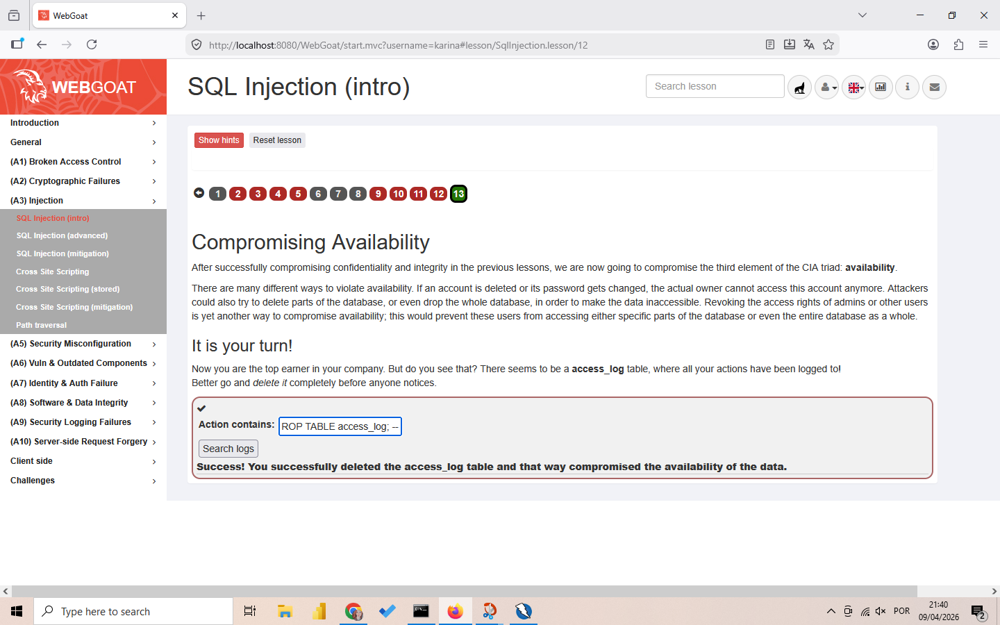
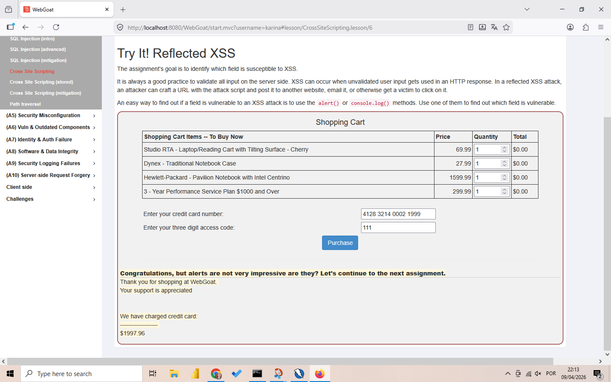

# Task 2: Web Application Security

## 📌 Objective
Learn about common web application vulnerabilities by analysing a simple web application.

---

## 1. Setup

### WebGoat Installation

WebGoat is an intentionally vulnerable web application maintained by OWASP for learning purposes.

**Steps taken:**
1. Downloaded the latest WebGoat JAR file from the official OWASP website
2. Ran WebGoat using the command: `java -jar webgoat-2023.8.jar`
3. Accessed WebGoat at `http://localhost:8080/WebGoat`
4. Created an account to start the lessons

<!--  -->

### OWASP ZAP Setup

OWASP ZAP (Zed Attack Proxy) is a web application security scanner.

**Steps taken:**
1. Downloaded and installed OWASP ZAP from the official website
2. Configured ZAP to proxy traffic through `localhost:8080`
3. Set up browser to use ZAP as a proxy
4. Accessed WebGoat through the browser while ZAP was running

<!--  -->

---

## 2. Vulnerability Analysis with OWASP ZAP

### Automated Scan

**Steps taken:**
1. Opened OWASP ZAP
2. Entered WebGoat URL: `http://localhost:8080/WebGoat`
3. Clicked "Attack" → "Active Scan"
4. Let ZAP crawl and scan the application

<!--  -->

### Scan Results Summary

| Vulnerability | Risk Level | Location |
|---------------|------------|----------|
| SQL Injection | High | Login form |
| Cross-Site Scripting (XSS) | Medium | Comment section |
| Cross-Site Request Forgery (CSRF) | Medium | Email change form |
| Missing Security Headers | Low | HTTP response headers |

<!--  -->

---

## 3. Vulnerability Exploration

### SQL Injection

**Description:** SQL Injection occurs when user input is improperly sanitized and inserted directly into SQL queries, allowing attackers to manipulate database queries.

**Discovery:** OWASP ZAP identified SQL injection vulnerabilities in the login form.

**Manual Exploitation:**
1. Navigated to the login form
2. Entered: `admin' OR '1'='1` as username
3. Entered anything as password
4. Successfully logged in without valid credentials

**Why it's dangerous:**
- Attackers can bypass authentication
- Can extract sensitive data (usernames, passwords, credit cards)
- Can modify or delete database records
- In some cases, can execute commands on the database server

<!--  -->

### Cross-Site Scripting (XSS)

**Description:** XSS allows attackers to inject malicious scripts into web pages viewed by other users.

**Discovery:** ZAP detected reflected XSS in the search field.

**Manual Exploitation:**
1. Found a comment field or search box
2. Entered: `<script>alert('XSS')</script>`
3. The script executed when the page loaded

**Why it's dangerous:**
- Steal session cookies (session hijacking)
- Deface websites
- Redirect users to malicious sites
- Capture keystrokes

<!--  -->

### Cross-Site Request Forgery (CSRF)

**Description:** CSRF tricks authenticated users into executing unwanted actions on web applications where they're currently authenticated.

**Discovery:** ZAP identified that the email change form lacked CSRF tokens.

**Manual Exploitation:**
1. Created a malicious HTML page
2. Embedded a request to change email address
3. When an authenticated user visited the page, their email was changed without consent

**Why it's dangerous:**
- Change user credentials
- Perform unauthorized transactions
- Modify account settings
- Execute actions with user's privileges

<!--  -->

---

## 4. Mitigation Recommendations

| Vulnerability | Mitigation Steps |
|---------------|------------------|
| **SQL Injection** | Use parameterized queries/prepared statements, input validation, least privilege database accounts |
| **XSS** | Output encoding, Content Security Policy (CSP), input validation, use HTTPOnly cookies |
| **CSRF** | Implement anti-CSRF tokens, SameSite cookies, re-authentication for sensitive actions |
| **Missing Headers** | Implement security headers: HSTS, X-Frame-Options, X-Content-Type-Options, Content-Security-Policy |

### Code Examples

#### SQL Injection Prevention (Parameterized Query)
```java
// Vulnerable code
String query = "SELECT * FROM users WHERE username = '" + username + "'";

// Secure code with parameterized query
PreparedStatement stmt = connection.prepareStatement("SELECT * FROM users WHERE username = ?");
stmt.setString(1, username);
