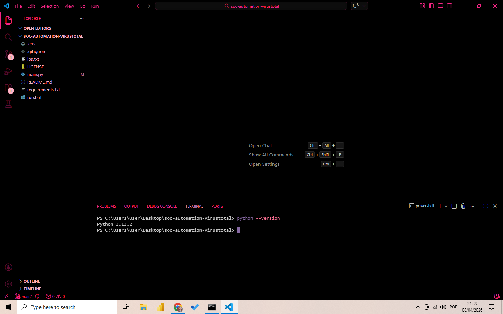

# Task 2: Web Application Security

## 📌 Objective
Learn about common web application vulnerabilities by analysing a simple web application.

---

## 1. Setup

### Python Environment

**Prerequisite check:**

### PyGoat Installation

PyGoat is an intentionally vulnerable web application maintained by OWASP, written in Python using the Django framework.

**Steps taken:**
1. Verified Python installation (`python --version`)
2. Installed PyGoat using pip: `pip install pygoat`
3. Started the application: `pygoat run`
4. Accessed PyGoat at `http://localhost:8000`

### OWASP ZAP Setup

OWASP ZAP (Zed Attack Proxy) is a web application security scanner.

**Steps taken:**
1. Downloaded and installed OWASP ZAP from the official website
2. Configured ZAP to proxy traffic through `localhost:8000`
3. Set up browser to use ZAP as a proxy
4. Accessed PyGoat through the browser while ZAP was running

---

## 2. Vulnerability Analysis with OWASP ZAP

### Automated Scan

**Steps taken:**
1. Opened OWASP ZAP
2. Entered PyGoat URL: `http://localhost:8000`
3. Clicked "Attack" → "Active Scan"
4. Let ZAP crawl and scan the application

### Scan Results Summary

| Vulnerability | Risk Level | Location |
|---------------|------------|----------|
| SQL Injection | High | Login form |
| Cross-Site Scripting (XSS) | Medium | Search/comment fields |
| Cross-Site Request Forgery (CSRF) | Medium | Form submissions |
| Missing Security Headers | Low | HTTP response headers |

---

## 3. Vulnerability Exploration

### SQL Injection

**Description:** SQL Injection occurs when user input is improperly sanitized and inserted directly into SQL queries, allowing attackers to manipulate database queries.

**Discovery:** OWASP ZAP identified SQL injection vulnerabilities in the login form.

**Manual Exploitation:**
1. Navigated to the login form
2. Entered: `admin' OR '1'='1` as username
3. Entered anything as password
4. Successfully logged in without valid credentials

**Why it's dangerous:**
- Attackers can bypass authentication
- Can extract sensitive data (usernames, passwords)
- Can modify or delete database records

### Cross-Site Scripting (XSS)

**Description:** XSS allows attackers to inject malicious scripts into web pages viewed by other users.

**Discovery:** ZAP detected reflected XSS in input fields.

**Manual Exploitation:**
1. Found a search box or comment field
2. Entered: ``
3. The script executed when the page loaded

**Why it's dangerous:**
- Steal session cookies (session hijacking)
- Deface websites
- Redirect users to malicious sites

### Cross-Site Request Forgery (CSRF)

**Description:** CSRF tricks authenticated users into executing unwanted actions on web applications where they're currently authenticated.

**Discovery:** ZAP identified that forms lacked CSRF tokens.

**Manual Exploitation:**
1. Created a malicious HTML page
2. Embedded a request to change email address
3. When an authenticated user visited the page, their email was changed without consent

**Why it's dangerous:**
- Change user credentials
- Perform unauthorized transactions
- Modify account settings

---

## 4. Mitigation Recommendations

| Vulnerability | Mitigation Steps |
|---------------|------------------|
| **SQL Injection** | Use parameterized queries/prepared statements, input validation, least privilege database accounts |
| **XSS** | Output encoding, Content Security Policy (CSP), input validation, use HTTPOnly cookies |
| **CSRF** | Implement anti-CSRF tokens, SameSite cookies, re-authentication for sensitive actions |
| **Missing Headers** | Implement security headers: HSTS, X-Frame-Options, X-Content-Type-Options |

---

## 5. Reflection

### Web Security Best Practices

In a real-world production environment, additional measures would include:

1. **Secure Development Lifecycle:** Security testing from the start of development
2. **Regular Security Training:** Developers trained on secure coding practices
3. **Web Application Firewall (WAF):** Additional layer of protection
4. **Regular Penetration Testing:** Professional security assessments
5. **Bug Bounty Program:** Incentivize researchers to find vulnerabilities

---

## 📸 Screenshots

| Screenshot | Description |
|------------|-------------|
| `python-version.png` | Python version verification |
| `pygoat-install.png` | PyGoat installation process |
| `pygoat-running.png` | PyGoat server running on terminal |
| `pygoat-home.png` | PyGoat home page in browser |
| `owasp-zap-interface.png` | OWASP ZAP main interface |
| `zap-scan-progress.png` | Active scan in progress |
| `zap-alerts.png` | Alerts found by ZAP |
| `sql-injection.png` | SQL injection demonstration |
| `xss.png` | XSS demonstration |
| `csrf.png` | CSRF demonstration |

---

## ✅ Task Completion Status

- [x] Python environment verified
- [x] PyGoat installed and configured
- [x] OWASP ZAP installed and configured
- [x] Active scan performed
- [x] SQL Injection identified and exploited
- [x] XSS identified and exploited
- [x] CSRF identified and exploited
- [x] Documentation complete
